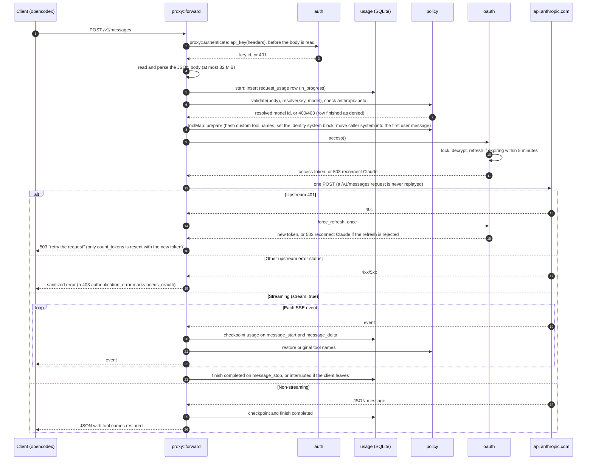

# Architecture

Shared Router is a single Rust binary built on Axum, with one SQLite database. It serves three friend-facing Anthropic Messages API routes, an owner dashboard with its JSON API, and two health probes. This page maps the modules and follows a `/v1/messages` request from arrival to final usage record. The code remains the source of truth; file references point into [`src/`](../src/).

## Modules

| Module | Responsibility |
|---|---|
| [`main.rs`](../src/main.rs) | CLI entry point. `serve` (default) loads config, opens the database, and runs the server; on Ctrl-C or SIGTERM it runs the shutdown sequence below. `generate-key`, `hash-password` (piped input only), `backup PATH`, `healthcheck`, and `help` are one-shot commands; stray arguments exit with status 2. |
| [`lib.rs`](../src/lib.rs) | `AppState` (config, SQLite pool, HTTP client, and OAuth state with the login throttle) and the router: health probes, friend routes, admin routes, the 32 MiB body limit, and default security headers (`no-store`, `nosniff`, `no-referrer`, the CSP, and `Strict-Transport-Security: max-age=31536000` when `PUBLIC_ORIGIN` is HTTPS), which a handler may override. |
| [`config.rs`](../src/config.rs) | Reads and validates environment variables at startup, and builds the upstream HTTP client with redirects and automatic retries disabled. |
| [`db.rs`](../src/db.rs) | Creates the database file (mode 600) and missing parent directories (mode 700), opens SQLite in WAL mode, runs embedded migrations, and performs startup recovery: unfinished requests become `interrupted` with an empty `finished_at`, and expired admin sessions are deleted. Also writes owner-only `backup` copies. |
| [`auth.rs`](../src/auth.rs) | Router key authentication (`x-api-key` or `Authorization: Bearer`, SHA-256 lookup), owner login with Argon2id and a login throttle, session cookies, the exact-origin check, and CSRF enforcement for admin mutations. |
| [`policy.rs`](../src/policy.rs) | Model resolution through grants and aliases, the request body allowlists, and `ToolMap`, which renames custom tools to hashed `custom_` names on the way up and restores them on the way down. |
| [`proxy.rs`](../src/proxy.rs) | Friend routes: `/v1/messages`, `/v1/messages/count_tokens`, and `/v1/models`. Runs the request pipeline below, the `anthropic-beta` allowlist, the SSE decoder, and response model verification. |
| [`oauth.rs`](../src/oauth.rs) | Claude OAuth PKCE login and completion, token encryption with XChaCha20-Poly1305 under `ENCRYPTION_KEY`, serialized access-token refresh, the `needs_reauth` state, and the fixed upstream headers. |
| [`usage.rs`](../src/usage.rs) | Per-request usage rows: start, allowlisted token checkpoints, final outcome, and a drop guard that records `interrupted` if a handler ends early. |
| [`analytics.rs`](../src/analytics.rs) | Read-only usage reports for `/admin/api/usage` and `/admin/api/analytics`: filters, grouping, totals, and paginated request history. |
| [`admin.rs`](../src/admin.rs) | Dashboard pages and static assets (`ASSET_VERSION` hashes the embedded assets; a request with the current `?v=` is cached for a year, any other gets `no-cache`), `/readyz`, and the admin JSON API for people, keys, grants, the model catalog, and aliases. |
| [`error.rs`](../src/error.rs) | `AppError`, the Anthropic-style JSON error envelope, the middleware that gives axum's own rejections that envelope ("Invalid JSON request body", "Invalid query parameters", or "Invalid request"), and the database error conversion that logs only a sanitized category. |
| [`tests/`](../src/tests/) | Integration tests against temporary SQLite databases and mock upstream servers: a shared harness (`harness.rs`), a mock Anthropic upstream (`mock_upstream.rs`), and one module per area. |

## Request flow for `/v1/messages`

The steps in order:

1. **Authentication.** The `proxy::authenticate` middleware runs `auth::api_key` on the headers alone, before any of the body is read, so requests without a valid key never cause the router to buffer or parse up to 32 MiB. `api_key` accepts exactly one `x-api-key` or `Authorization: Bearer` value (both are allowed only if they match), requires the `sr_` format, looks up the SHA-256 hash among unrevoked keys, and updates `last_used_at` at most once a minute per key. Only then does the handler read and parse the JSON body, within the 32 MiB limit.
2. **Usage row.** `usage::start` records the attempt as `in_progress`. A `RequestGuard` ensures the row reaches a terminal outcome even if the handler is cancelled.
3. **Policy.** `policy::validate` enforces the request field allowlists (see the README's accepted request surface). `policy::resolve` maps the requested ID or explicit alias to a reviewed, enabled model granted to this unrevoked key. Caller `anthropic-beta` values must all be in `proxy::CLIENT_BETAS` or the router's own `oauth::BETA`. Any failure finishes the row as `denied`.
4. **Rewrite.** `ToolMap::prepare` renames custom tools and matching `tool_use` blocks to stable hashed `custom_` names and sets `system` to the required identity block, moving the caller's system blocks into the first user message as `<system-reminder>` blocks. Server tools keep their names.
5. **No admission limits.** The router does not cap concurrent requests per key or in total, and sets no token or request quotas. Every request is recorded in `request_usage` for reporting; Claude enforces the subscription limits, and its 429s are passed through.
6. **Credential.** `oauth::access` decrypts the stored tokens. A token that expires more than 5 minutes from now is used without locking; otherwise one caller at a time refreshes it under the refresh lock, and a generation counter guards the write. A refresh rejected with 400, 401, or 403 marks the credential `needs_reauth`, and requests get `503` until the owner reconnects. A transient refresh failure starts a 30-second backoff, during which the current token is used while it is still valid. A credential that cannot be decrypted is also marked `needs_reauth`.
7. **Upstream call.** The router sends one POST with the owner's token and fixed client headers. Incoming credentials are never forwarded. The HTTP client has retries and redirects disabled, and no code path replays a `/v1/messages` request, including after 429s, network errors, timeouts, or a 401. The client itself allows 15 seconds to connect and 120 seconds between reads, with no total timeout; each call sets its own limit instead. A non-streaming `/v1/messages` call times out after 600 seconds (`proxy::MESSAGE_TIMEOUT`, matching the `x-stainless-timeout` header sent upstream) and a token count after 60 seconds (`COUNT_TOKENS_TIMEOUT`); a timeout returns `502 api_error`. A stream may run for 60 minutes (`MAX_STREAM_DURATION`); a longer one ends with a `timeout_error` event and is recorded as `interrupted`. Catalog pages fetched by the dashboard time out after 30 seconds each (`admin::CATALOG_REQUEST_TIMEOUT`).
8. **Upstream 401.** `oauth::force_refresh` refreshes the token once; if another request has already replaced that token generation, it reuses the newer token instead. A token count is sent again with the new token. A `/v1/messages` request is finished as `upstream_error` and its client gets a retryable `503 api_error` ("The router renewed its Claude session. Retry the request"). Only a rejected refresh, or a second 401 for the resent token count, marks the credential `needs_reauth`.
9. **Response.** Other error statuses return a fixed message with the upstream status and its matching Anthropic error type (redirects become 502), and `retry-after` is passed through. A 403 marks the credential `needs_reauth` only when its `error.type` is `authentication_error`; the body is read up to 64 KiB and never logged or returned. Successful responses are checked against the resolved model; a non-streaming mismatch becomes `502 api_error` "Claude answered with a different model than requested", and a streaming one ends the stream with an `api_error` event.
10. **Accounting.** Streaming usage is checkpointed before each usage-bearing event is forwarded. Cumulative counters replace earlier values. The row is finished once as `completed`, `upstream_error`, or `interrupted`. Only the four allowlisted numeric token fields are stored.

`/v1/messages/count_tokens` follows the same path with `counting` set: `max_tokens` is optional, streaming is refused, and usage is recorded as `not_applicable`, which keeps it out of consumed-token reports. `/v1/models` authenticates the key and lists its granted, reviewed, enabled models.

## Process-local coordination

Two pieces of state live in the process: the OAuth mutex that serializes login and refresh, and the login throttle (five failed sign-ins per client address and 30 in total per minute). The client address is the socket peer, or, when `TRUSTED_PROXY_HOPS` is N greater than 0, the N-th `X-Forwarded-For` entry from the right; `Config` reads the setting at startup and refuses to start when it is not a non-negative integer. Pending OAuth logins live there too. Startup recovery also assumes that no other process is writing `in_progress` rows. A second replica on the same database would race refresh-token rotation, and mark the other replica's live requests as interrupted when it starts. Run exactly one router process per database.

## Shutdown

`main.rs` keeps the server phase in a watch channel on `AppState` and stops in fixed steps, all within the 30-second `stop_grace_period` in `compose.yaml`:

1. **Draining.** On Ctrl-C or SIGTERM the phase becomes `Draining`. `/readyz` answers 503 "The router is shutting down", the server stops accepting connections, and open requests may finish for up to 20 seconds (`DRAIN_PERIOD`).
2. **Stopping.** When the drain period ends, the phase becomes `Stopping`. Each open stream checkpoints the usage it has seen, sends an `api_error` event, ends, and is recorded as `interrupted`. The server gets up to 3 more seconds (`INTERRUPT_GRACE`) to close.
3. **Closing.** `db::interrupt_in_flight` records every row still `in_progress`, such as a non-streaming call, as `interrupted` with the shutdown time. The pool then gets up to 5 seconds (`CLOSE_TIMEOUT`) to close, which also merges the WAL.

If the process is killed instead, startup recovery marks the leftover rows `interrupted` with an empty `finished_at`.

## Admin surface

Admin routes live in `admin.rs`. The HTML pages (`/admin` and the sign-in page) answer a template failure with a small HTML 500 page and a log line; everything under `/admin/api/` returns the JSON envelope. Everything under `/admin/api/` except `login` passes through `auth::require_admin`: a valid session cookie is required, and methods other than GET and HEAD also need the exact configured `Origin` and a matching `X-CSRF-Token`. Admin bodies are capped at 64 KiB. `POST /admin/api/models/refresh` lists the upstream catalog page by page; listing is idempotent, so on a 401 it calls `oauth::force_refresh` once and fetches the page again. Only a second 401, or a 403 of type `authentication_error`, marks the credential `needs_reauth`; any other 403 returns `permission_error` and leaves Claude connected. Friend keys never authorize admin routes.
