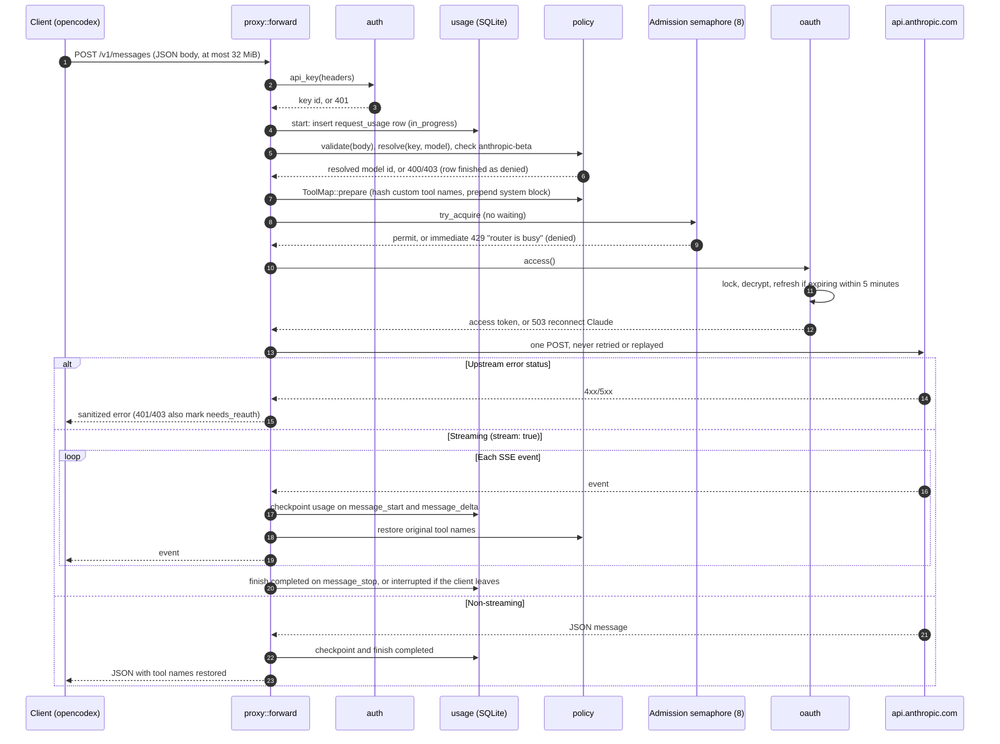

# Architecture

Shared Router is a single Rust binary built on Axum, with one SQLite database. It serves three friend-facing Anthropic Messages API routes, an owner dashboard with its JSON API, and two health probes. This page maps the modules and follows a `/v1/messages` request from arrival to final usage record. The code remains the source of truth; file references point into [`src/`](../src/).

## Modules

| Module | Responsibility |
|---|---|
| [`main.rs`](../src/main.rs) | CLI entry point. `serve` (default) loads config, opens the database, and runs the server with graceful shutdown on Ctrl-C or SIGTERM. `generate-key`, `hash-password`, and `backup PATH` are one-shot helper commands. |
| [`lib.rs`](../src/lib.rs) | `AppState` (config, SQLite pool, HTTP client, OAuth lock, login throttle, admission semaphore) and the router: health probes, friend routes, admin routes, the 32 MiB body limit, and security headers on every response. |
| [`config.rs`](../src/config.rs) | Reads and validates environment variables at startup, and builds the upstream HTTP client with redirects and automatic retries disabled. |
| [`db.rs`](../src/db.rs) | Opens SQLite in WAL mode, runs embedded migrations, and performs startup recovery: unfinished requests become `interrupted` and expired admin sessions are deleted. |
| [`auth.rs`](../src/auth.rs) | Router key authentication (`x-api-key` or `Authorization: Bearer`, SHA-256 lookup), owner login with Argon2id and a login throttle, session cookies, the exact-origin check, and CSRF enforcement for admin mutations. |
| [`policy.rs`](../src/policy.rs) | The Fable 5.1 block, model resolution through grants and aliases, the request body allowlists, and `ToolMap`, which renames custom tools to hashed `custom_` names on the way up and restores them on the way down. |
| [`proxy.rs`](../src/proxy.rs) | Friend routes: `/v1/messages`, `/v1/messages/count_tokens`, and `/v1/models`. Runs the request pipeline below, the `anthropic-beta` allowlist, the SSE decoder, and response model verification. |
| [`oauth.rs`](../src/oauth.rs) | Claude OAuth PKCE login and completion, token encryption with XChaCha20-Poly1305 under `ENCRYPTION_KEY`, serialized access-token refresh, the `needs_reauth` state, and the fixed upstream headers. |
| [`usage.rs`](../src/usage.rs) | Per-request usage rows: start, allowlisted token checkpoints, final outcome, and a drop guard that records `interrupted` if a handler ends early. |
| [`analytics.rs`](../src/analytics.rs) | Read-only usage reports for `/admin/api/usage` and `/admin/api/analytics`: filters, grouping, totals, and paginated request history. |
| [`admin.rs`](../src/admin.rs) | Dashboard pages and static assets, `/readyz`, and the admin JSON API for people, keys, grants, the model catalog, and aliases. |
| [`error.rs`](../src/error.rs) | `AppError`, the Anthropic-style JSON error envelope, and the database error conversion that logs only a fixed message. |
| [`tests.rs`](../src/tests.rs) | Integration tests against temporary SQLite databases and mock upstream servers. |

## Request flow for `/v1/messages`

The steps in order:

1. **Authentication.** `auth::api_key` accepts exactly one `x-api-key` or `Authorization: Bearer` value (both are allowed only if they match), requires the `sr_` format, looks up the SHA-256 hash among unrevoked keys, and updates `last_used_at`. Axum has already read and parsed the JSON body at this point, within the 32 MiB limit.
2. **Usage row.** `usage::start` records the attempt as `in_progress`. A `RequestGuard` ensures the row reaches a terminal outcome even if the handler is cancelled.
3. **Policy.** `policy::validate` enforces the request field allowlists (see the README's accepted request surface). `policy::resolve` maps the requested ID or explicit alias to a reviewed, enabled model granted to this unrevoked key and rejects Fable 5.1. Caller `anthropic-beta` values must all be on the allowlist in `proxy.rs`. Any failure finishes the row as `denied`.
4. **Rewrite.** `ToolMap::prepare` renames custom tools and matching `tool_use` blocks to stable hashed `custom_` names and prepends the required system block. Server tools keep their names.
5. **Admission.** A process-wide semaphore allows 8 concurrent upstream requests across all keys. The router does not queue: request 9 gets an immediate `429 rate_limit_error` ("The router is busy"). A streaming response holds its permit until the stream ends.
6. **Credential.** `oauth::access` holds the OAuth mutex, decrypts the stored tokens, and refreshes them when they expire within 5 minutes. A generation counter guards the write. A refresh rejected with 400, 401, or 403 marks the credential `needs_reauth`, and requests get `503` until the owner reconnects.
7. **Upstream call.** The router sends one POST with the owner's token and fixed client headers. Incoming credentials are never forwarded. The HTTP client has retries and redirects disabled, and no code path replays a `/v1/messages` request, including after 429s or network errors.
8. **Response.** Error statuses return a fixed message with the upstream status (redirects become 502), and `retry-after` is passed through. Upstream 401 or 403 marks the credential `needs_reauth`. Successful responses are checked against the resolved model; a mismatch becomes 502.
9. **Accounting.** Streaming usage is checkpointed before each usage-bearing event is forwarded. Cumulative counters replace earlier values. The row is finished once as `completed`, `upstream_error`, or `interrupted`. Only the four allowlisted numeric token fields are stored.

`/v1/messages/count_tokens` follows the same path with `counting` set: `max_tokens` is optional, streaming is refused, and usage is recorded as `not_applicable`, which keeps it out of consumed-token reports. `/v1/models` authenticates the key and lists its granted, reviewed, enabled models, filtering out Fable 5.1.

## Process-local coordination

Three pieces of state live in the process: the OAuth mutex that serializes login and refresh, the admission semaphore, and the login throttle (five attempts per minute for the whole service). Pending OAuth logins live there too. Startup recovery also assumes that no other process is writing `in_progress` rows. A second replica on the same database would double the admission limit, race refresh-token rotation, and mark the other replica's live requests as interrupted when it starts. Run exactly one router process per database.

## Admin surface

Admin routes live in `admin.rs`. Everything under `/admin/api/` except `login` passes through `auth::require_admin`: a valid session cookie is required, and methods other than GET and HEAD also need the exact configured `Origin` and a matching `X-CSRF-Token`. Admin bodies are capped at 64 KiB. Friend keys never authorize admin routes.
